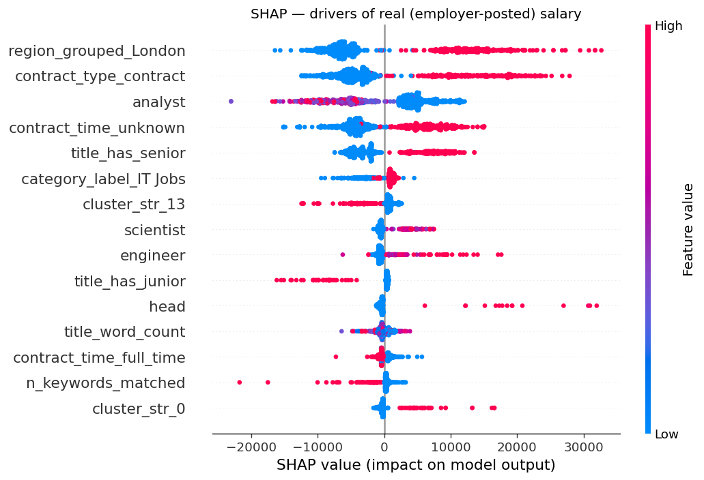

# Phase 5 — Salary Modelling Findings

Captures the salary prediction modelling phase of the UK Data Analyst Job
Market NLP project. Two models trained side by side — one on employer-posted
salaries, one on Adzuna's predicted salaries — to compare what each set of
salaries reflects.

## Methodology

### Targets

Two target variables, modelled independently:

1. **Real (employer-posted) salaries** — 1,001 postings where `salary_is_predicted = False`. These are salary figures published by the employer themselves.
2. **Adzuna predicted salaries** — 1,823 postings where `salary_is_predicted = True`. These are Adzuna's own model-generated estimates.

Both target variables use `salary_midpoint = (salary_min + salary_max) / 2`.

### Outlier handling

Before training:

- **8 low outliers removed** (< £15K). All were employer-posted data entry errors (£1, £25, £400 — almost certainly day rates entered as annual salaries, or empty fields filled with placeholder digits).
- **6 high outliers capped at £200K** (winsorising). These included one US-pharma VP role, one Investment Banking role, and several freelance day-rates annualised. Cap chosen to retain genuine UK senior role salaries without letting US/freelance figures distort the model.
- **3 rows with missing salary_midpoint** dropped.

Final modelling dataset: **2,824 rows** (1,001 real + 1,823 predicted).

### Features (up to ~267)

Three feature groups:

| Group | n | Source |
|---|---:|---|
| Categorical (one-hot encoded) | up to 62 | Cluster archetype, region (top 15 + "Other"), category label, contract type, contract time |
| Text (TF-IDF) | up to 200 | Title text, 1-2 word n-grams, min_df=5, top 200 by frequency |
| Numeric (scaled) | 5 | Title word count, has_senior flag, has_junior flag, description length, n_keywords_matched |

Because preprocessing is fit per-fold on each target's own rows (see below), the exact feature count differs by target: **237 features** for the real-salary model and **266** for the predicted-salary model. (The earlier leaky version fit on the combined dataset and produced a fixed 267.)

Title text only — not description text. Earlier work (Phase 4) established that the truncated 75-word description snippets carry too little role-distinguishing signal compared to titles.

### No data leakage in cross-validation

All preprocessing — TF-IDF, one-hot encoding, and the numeric scaler — is fit
**inside** each cross-validation fold via a scikit-learn `Pipeline`
(`ColumnTransformer` + estimator). No information from a validation fold is used
to fit the vectoriser vocabulary, IDF weights, scaler statistics, or one-hot
categories. Each target (real / predicted) is modelled on its own subset, so the
real-salary model never sees predicted-salary rows during preprocessing. (An
earlier version of this notebook fit preprocessing once on the full dataset
before splitting; that leaked validation-fold information and inflated R² by
roughly 1–2 points. The numbers below are the leak-free figures.)

### Models compared

Four models trained on each target with identical 5-fold cross-validation:

| Model | Configuration |
|---|---|
| Baseline (DummyRegressor) | Predicts the training-set mean |
| Ridge Regression | alpha=1.0, L2 regularisation |
| Random Forest | 200 trees, max_depth=15 |
| XGBoost | 300 trees, max_depth=6, learning_rate=0.1 |

### Evaluation metrics

- **R²** — proportion of salary variance explained
- **MAE (Mean Absolute Error)** — average £ error in predictions
- Both reported as mean ± std across the 5 CV folds

## Results

### Real (employer-posted) salaries

| Model | R² | MAE |
|---|---:|---:|
| Baseline (predict mean) | -0.011 ± 0.011 | £28,280 ± £1,996 |
| Ridge Regression | 0.421 ± 0.082 | £20,078 ± £1,030 |
| Random Forest | 0.481 ± 0.051 | £17,352 ± £1,065 |
| **XGBoost** | **0.503 ± 0.085** | **£16,752 ± £1,098** |

### Adzuna-predicted salaries

| Model | R² | MAE |
|---|---:|---:|
| Baseline (predict mean) | -0.008 ± 0.004 | £13,039 ± £667 |
| Ridge Regression | 0.365 ± 0.058 | £9,972 ± £777 |
| Random Forest | 0.357 ± 0.077 | £9,969 ± £804 |
| **XGBoost** | **0.377 ± 0.072** | **£9,608 ± £774** |

## Findings

### 1. Real employer-posted salaries are *more* predictable than Adzuna's own predictions

This was unexpected. The initial hypothesis was that Adzuna's predictions would be more learnable — being themselves model-generated, they should follow tractable patterns derived from features available in the data.

The opposite is true. XGBoost explains **50.3% of variance in real salaries** but only **37.7% of variance in Adzuna's predictions**. The MAE improvement over baseline is 41% for real salaries versus 26% for Adzuna's predictions.

Likely explanation: Adzuna's prediction model uses signals not in this dataset — possibly internal click-through data, posting history, employer profiles, finer-grained location precision, or industry-specific calibrations. Our feature set captures roughly half the variance in real salary data, but only a third of the variance in Adzuna's model output.

This finding inverts the conventional assumption about model-vs-model comparison and is itself a methodological observation worth flagging.

### 2. Adzuna's prediction model appears to underweight UK location

In the real-salaries model, `region_grouped_London` is the **#2 most important feature** (3.9% importance). In the Adzuna-predictions model, London falls to **#39** and does not appear anywhere near the top 20.

This suggests Adzuna's prediction model either:

- Treats location through a separate sub-model not captured by feature importance
- Applies location adjustments at a different stage (post-hoc rather than as a feature)
- Underweights UK regional pay differences

Without access to Adzuna's model internals this cannot be confirmed, but the discrepancy is meaningful and worth noting in any analysis using their predicted salaries.

### 3. Title seniority flags are the strongest single salary predictor

Both models put `title_has_senior` (7.4% in predicted, 3.5% in real) and `title_has_junior` (4.1% in predicted, 2.4% in real) at or near the top of their importance rankings. In the Adzuna-predictions model they are the #1 and #2 features outright. The single most powerful predictor of UK data salary is whether the word "Senior" (or "Lead", "Principal", "Head", "Director", "Manager", "Chief") appears in the job title.

This is intuitive but worth quantifying. Models with all ~240–270 features available consistently pick the simplest possible heuristic — "is this a senior title or not?" — as a primary signal.

### 4. Real salaries reward specific terms; Adzuna predictions reward generic role labels

Looking past the seniority flags, the top features diverge meaningfully:

**Real salaries top terms (after London and seniority):**

- "12" / "month" (12-month FTC framing), "cleared" (security-cleared roles), "martech", "analyst month", "scientist", "contract"

**Adzuna prediction top terms (after seniority):**

- "analyst", "vp", "president", "intern", "head", "scientist ai", "science engineer", "staff"

Real salaries surface specific contract and tool/skill terms (security clearance, martech, fixed-term framing). Adzuna's model surfaces generic role types and seniority titles. This suggests employer salaries are calibrated against specific skill/contract combinations, while Adzuna's predictions calibrate against role-category averages.

Note: with 200 TF-IDF features each contributing only 2–3%, these specific-term rankings are noisy and should be read directionally — the stable signal is that real salaries reward specific terms while predictions reward generic role labels.

### 5. On Adzuna predictions the signal is essentially linear; on real salaries the tree models add more

On Adzuna predictions: Ridge 0.365 ≈ Random Forest 0.357, with XGBoost only 1.2 R² points ahead (0.377). The predicted-salary signal is almost entirely linear — a simple Ridge model is fully defensible.

On real salaries the gap is wider: Ridge 0.421 → Random Forest 0.481 → XGBoost 0.503. The tree models add ~8 R² points over Ridge, indicating genuine non-linear interaction effects in real employer salaries that the linear model misses.

Practical implication: for modelling Adzuna's predictions, reach for the simplest model; for real salaries, the boosted model earns its complexity.

### 6. Cluster labels are not dominant features

Despite Phase 4 producing 17 distinct role archetypes via clustering, only one cluster label appears in the top 20 features of either model (`cluster_str_12`, the AI/ML cluster, at #9 in the Adzuna-predictions model).

This is a slightly humbling finding for the clustering work: the unsupervised clusters tell an interesting story about role types, but the *direct salary signal* lives in title text and seniority flags rather than the cluster IDs. The clusters describe the role landscape; they don't predict salary on their own.

### 7. MAE of £17K means the model is useful for analysis, not for individual salary advice

The XGBoost real-salaries model predicts to within **£16,752** on average. For a dataset with mean salary around £62K, this is roughly 27% relative error.

Honest implication: this model is appropriate for *understanding salary drivers* (which features matter, how much each contributes) but **not** for *individual career advice* (whether to take a £55K offer). A person looking at a £60K role would want predictions accurate to £2-3K — this model is off by ~£17K on average. Any portfolio framing should make this distinction explicit rather than overclaiming.

### 8. A log-salary target gives a small, mostly-linear-model improvement

Salaries are right-skewed, so we tested a `log(salary)` target (via `TransformedTargetRegressor`,
with predictions back-transformed to £ so the metrics stay comparable):

| Model | Target | Real R² | Real MAE | Adzuna R² | Adzuna MAE |
|---|---|---:|---:|---:|---:|
| Ridge | linear £ | 0.421 | £20,078 | 0.365 | £9,972 |
| Ridge | log £ | 0.425 | **£19,129** | 0.366 | £9,850 |
| XGBoost | linear £ | 0.503 | £16,752 | 0.377 | £9,608 |
| XGBoost | log £ | 0.505 | £16,401 | 0.376 | £9,593 |

The log target consistently lowers **MAE** — most for the linear model on real salaries
(Ridge £20,078 → £19,129, a ~£950 gain), modestly for XGBoost (£16,752 → £16,401). R² barely moves.
Interpretation: the right-skew matters more for a linear-in-£ model than for the boosted model, which
already absorbs the skew through its splits. Worth adopting a log target if you ship the linear model;
not a game-changer for the boosted one.

### 9. SHAP: location is the single largest £ driver of real salary

Gain-based importance says *which* features the model uses; **SHAP** says *how much* and *in which
direction*, in pounds. TreeSHAP on the real-salary XGBoost gives a mean base value of £69,884 and these
average absolute impacts:

| Feature | Mean \|SHAP\| (£) | Direction |
|---|---:|---|
| `region_grouped_London` | £8,910 | London present pushes salary **up** |
| `contract_type_contract` | £7,311 | contractor roles **up** |
| `analyst` (title token) | £5,791 | generic "analyst" pulls **down** |
| `contract_time_unknown` | £5,489 | mixed |
| `title_has_senior` | £4,837 | senior titles **up** |
| `category_label_IT Jobs` | £1,602 | up |
| `cluster_str_13` | £1,327 | role-cluster effect |
| `title_has_junior` | £772 | junior titles **down** |

This is the £-denominated, directional version of the importance ranking, and it sharpens finding #2:
**London is the biggest single swing in real UK data salaries (~£9K average)** — the very signal
Adzuna's own prediction model appears to underweight. The word "analyst" acting as a downward pull
quantifies the "non-specialist analyst floor" seen in the clustering. See also `shap_bar_real.png`.

## Acknowledged Limitations

1. **Sample size for real salaries.** Only 1,001 postings have employer-posted salaries. This is a meaningful sample but not large; CV folds use ~200 postings each for evaluation.
2. **No external salary data.** The model has no access to Glassdoor, Indeed, LinkedIn salary data, or government wage statistics. Predictions are entirely based on the posting text and metadata.
3. **Salary distribution is not normal.** Salaries are right-skewed (long tail above £100K) even after winsorising. A `log(salary)` target (finding #8) gives a small MAE improvement but does not change the headline story.
4. **Feature importance from XGBoost is noisy.** With ~240–270 features, each contributes 8% at most and most contribute 2-3%. The SHAP analysis (finding #9) gives a more stable, £-denominated, directional read; tree-gain importance rankings should be treated as directional only.

## Output Files

- `data/processed/model_results_real.csv` — 5-fold CV results, real salaries
- `data/processed/model_results_predicted.csv` — 5-fold CV results, Adzuna predictions
- `data/processed/feature_importance_real.csv` — full tree-gain importance ranking, real model
- `data/processed/feature_importance_predicted.csv` — full tree-gain importance ranking, Adzuna model
- `data/processed/shap_importance_real.csv` — mean |SHAP| (£ impact) ranking, real model
- `docs/shap_summary_real.png`, `docs/shap_bar_real.png` — SHAP beeswarm and bar plots
